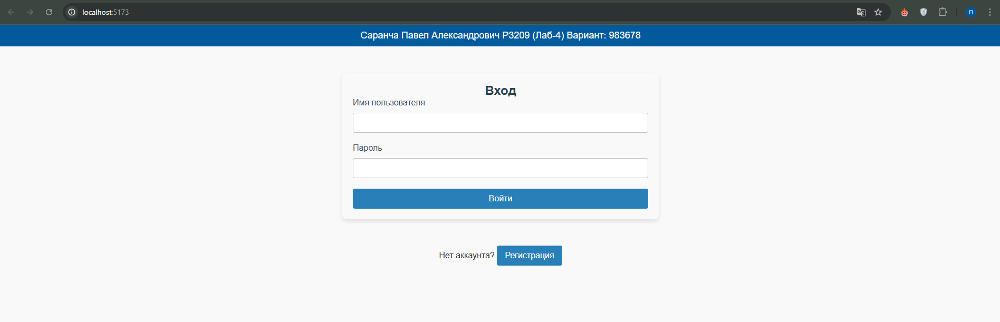
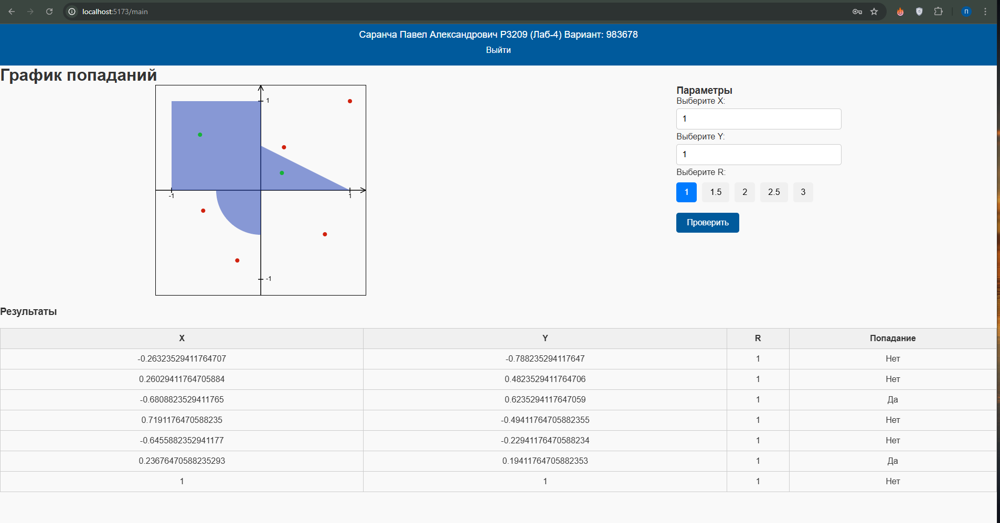

# Проект на Go и React

## Используемый стек

### Backend:
- **Go** - основной язык
- **Gin** - веб-фреймворк на Go
- **GORM** - ORM для работы с PostgreSQL
- **JSON Web Tokens (JWT)** - для защиты данных

### Frontend:
- **React** - библиотека для создания пользовательских интерфейсов
- **Node.js** - версия: `v22.12.0`
- **Vite** - версия: `6.0.1` (это последняя версия Vite для создания шаблона React проекта)
- **React + TypeScript** - для типизации и улучшения разработки

## Запуск проекта

Следуйте этим шагам для запуска проекта:

1. Зайдите в директорию проекта и смените имя файла .env.example на .env:
   ```bash
   mv .env.example .env
   ```

2. Запустите backend:
   ```bash
   go run backend/main.go
   ```

4. Зайдите в директорию frontend и запустите frontend (Vite):
   ```bash
   cd frontend/
   npm run dev
   ```
## Результат:



